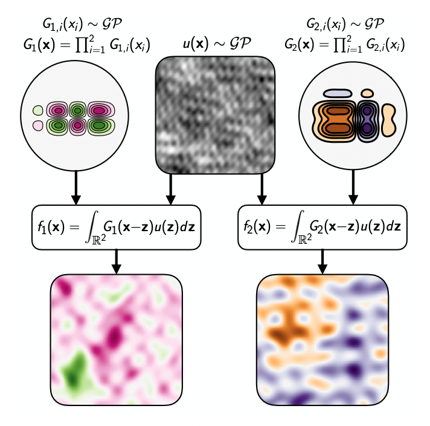

# npcgp


Implementation of the GP with nonparametric covariances via multidimensional convolutions (NP-CGP), to appear in AISTATS 2023.

```
[CITATION HERE]
```

The code was jointly written by [magnusross](https://github.com/magnusross) and [tomcdonald](https://github.com/tomcdonald).


To install, clone the repo, and then run:

```
conda create --name npcgp_env python=3.9
conda activate npcgp_env
pip install -e .
```
This will install the CPU version of PyTorch, for the GPU version, follow the instructions [here](https://pytorch.org/get-started/locally/) to install the correct version for your GPU. 

You can run the model on the UCI data with `python uci.py`, and run `python uci.py -h` for help with possible arguments. 


